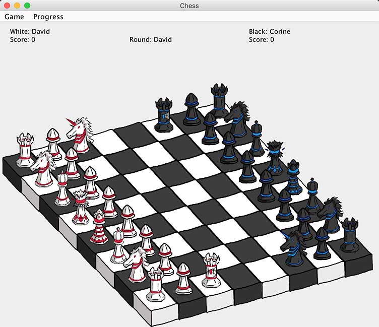

# Chess

A chess game written in Java and Swing.

## Documentation

Before generating the documentation, make sure you have already install [Doxygen](http://www.stack.nl/~dimitri/doxygen/)

Then, at the root directory, run

```bash
doxygen Doxyfile
```

The documentation should be generated at `doc/html/index.html`

## Screenshot



For details on how the game should look like, see [the GUI manual](./manual/manual.pdf)

## Image Assets

This game come with two complete set of images for chess pieces (black & white), four fairy pieces (black & white unicorn and artillery), and two board color (black & white), available at [src/main/resources/pieces](./src/main/resources/pieces), that I designed specifically for this game. Feel free to download and use them for **non-profit** purpose - the only thing you need to do is to mention my name (Xiaoyan Wang) and add a link to this repository.
